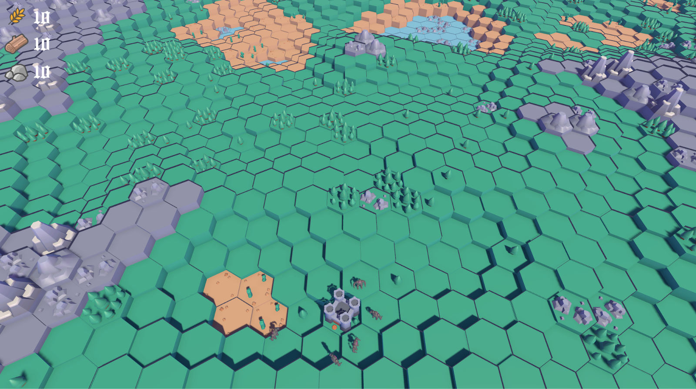
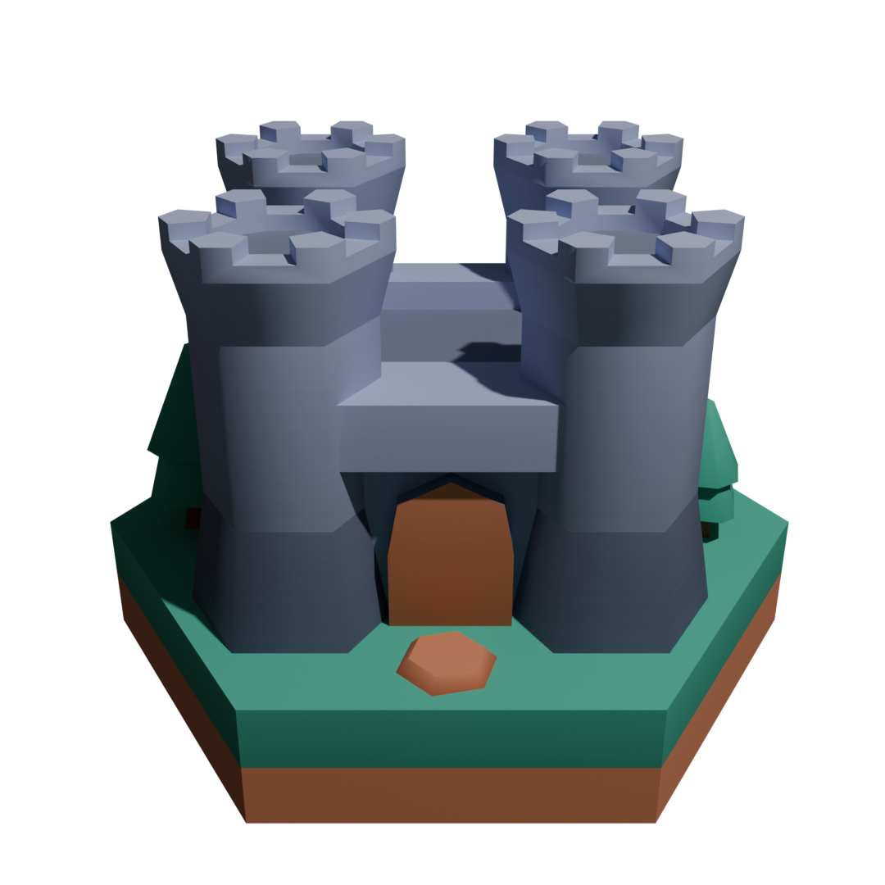

# Real-Time Strategy Game

## General Overview

- We have decided to take the difficult route and start the project from scratch.

- For that reason, many aspects of the game are constantly evolving, and a few AI features might change depending on how each one performs.

- The game map is generated from perlin noise and structured with hexagonal tiles.

- Gameplay features include :

  - Naturally spawning resources (lumber and stone).

  - Constructing buildings with lumber and/or stone.

  - Resource harvesting with dedicated buildings (mines for stone, lumbermills for lumber and farms for crops).
    - Construction of buildings to harvest naturally spawning resources (lumber and stone) necessitates sending one or more troops to claim the resource as the faction’s property.

  - Forming troops through the barracks building using crops.
    - Knight: low cost, low health soldier
    - Archer: low cost, very low health troop with ranged attack capability
    - Cavalier: mid cost, mid health unit with high mobility and high attack speed
    - Golem: high cost, high health and high damage troop with low mobility and low attack speed

  - Expanding the faction’s construction range by building new castles using a high quantity of lumber and stone (each faction starts with 1 as their HQ).

  - Attacking other factions’ troops and buildings.

  - Guarding one’s buildings with allied troops.

  - Repairing damaged buildings out of combat with lumber and/or stone.

  - The win condition is to have destroyed every opposing factions’ castles.

## List of gameplay objects and their in-game models

- Natural resources (resp. lumber and stone)

     

- Resource gathering buildings (resp. farm, lumbermill and mine)

      

- Other buildings (resp. barracks and castle)

     

- Troops (resp. knight, archer and golem)

      

## Data used by AI to make decisions

- Influence map of buildings per faction
  - Used to find the most strategic places to attack, as well as zones other factions don’t have influence on and where it is safe to build.

- Influence map of troops per faction
  - Used to find the safest places on the map, as well as the best guarded areas.

- Influence map of natural resources
  - Used to find the most interesting resource-rich areas on the map, that should be conquered and defended for resource harvesting.

- Height map
  - Used to find strategic vantage points, as well as to avoid sand and especially water (low elevation areas).

- Navigation mesh
  - Used to find places with many navigation options, or strategic natural borders.

- Sphere collider triggers
  - Used by every troop for fast and easy close range detection of enemy troops.

## Individual AI for troops

- All individual troops will be piloted using a low-level AI.

- Behavior will be implemented using a Finite State Machine with the following states:

  - Standby
    - Either standing in place or wandering randomly in a small zone. 
    - Transition to Navigating if a destination is selected, or to Attacking if threatened by enemy troops.

  - Navigating
    - Using Unity’s NavMesh system to move towards a designated location. The destination can be changed at any time.
    - When the destination is reached, transition to Standby by default, Attacking if an enemy building or troop was selected, or Guarding if an ally building was selected or a resource was claimed.

  - Guarding
    - Standing next to an ally building.
    - Transition to Attacking if enemy troops get too close, or to Navigating if another destination is selected.

  - Attacking
    - Different behavior for each troop type:
      - Close range attackers (golems and knights) move towards the target and attack it. 
      - High speed attackers (cavaliers) flank the target or detect incoming reinforcements and attack them. 
      - Finally, long range attackers stay in a backline formation to damage the target from range. If they detect enemies targeting them, they may call on other members of the crowd for help.
    - Transition to Navigating if another destination is selected, or to Standby when the target is destroyed.

## Crowd AI for groups of troops

- When troops are selected together to navigate to the same location, guard the same ally building, or attack the same enemy troops or building, they are assigned to a group called a Crowd.

- All troops in a crowd will have their movement speed lowered to that of the lowest troop in the group.

- Each crowd will have its own mid-level AI that tells troops where to place themselves in relation to each other, depending on the situation.

- These formations are defined as follows:

  - When navigating to claim a resource, the crowd assumes a vertical line formation, or a diamond formation if there are 4 or more troops.

  - When navigating within enemy territory, the crowd will take a circular formation, with high HP units on the outside, and low HP units in the center for maximum protection.

  - When navigating to attack, troops make horizontal lines based on their maximum health, with high HP units first, and low HP units last. This formation shouldn't be wider than a few tiles, so if many units of the same health travel together, they may distribute themselves on multiple lines. In addition, high speed troops like cavaliers might position themselves on the sides of the formation for easy flanking of the enemy.

  - When guarding a building, the crowd will assume a similar formation as when navigating enemy territory: circular with high health troops on the outside and the building in the center. They might circle the target building.

  - When attacking, each troop’s movement speed is reset back to default. All units follow their own FSM for direction and movement.

## Strategical AI for enemy factions

- Enemy factions will make meaningful decisions using a high-level AI each.

- The AI will be implemented as a Goal-Oriented Planner with the following goals:

  - Place a new building 

    - Castle
      - Weight increases if an unclaimed strategic area is out of construction range, or if the faction possesses more than enough building resources and has no other use for them.

    - Barracks
      - Weight increases when new troops need to be formed but the other Barracks (if any) are far away from the troop destination.

    - Farm, Lumbermill or Mine
      - Weight increases when another action needs to be performed but lacks the necessary resources.

  - Repair a damaged building
    - Weight proportional to the health/maxHealth ratio of the most damaged building.

  - Form new troops
    - Weight increases with the amount of crops owned by the faction and with the number of other buildings the faction has constructed.

  - Assign troops to guard a building
    - Weight increases with how close the building is to enemy borders, as well as how resource-rich the area is (strategic interest for other factions). There is also a constant weight to defend the faction’s castle(s).

  - Attack a group of enemy troops or an enemy building
    - Weight increases if:
      - An enemy is holding a strategic position that could be taken advantage of.
      - An enemy building is on the edge of their borders.
      - Enemy troops or buildings are on the path to the enemy’s castle(s).
      - In addition, the drive to attack enemy castles slowly goes up as the number of troops formed by the faction goes up.
